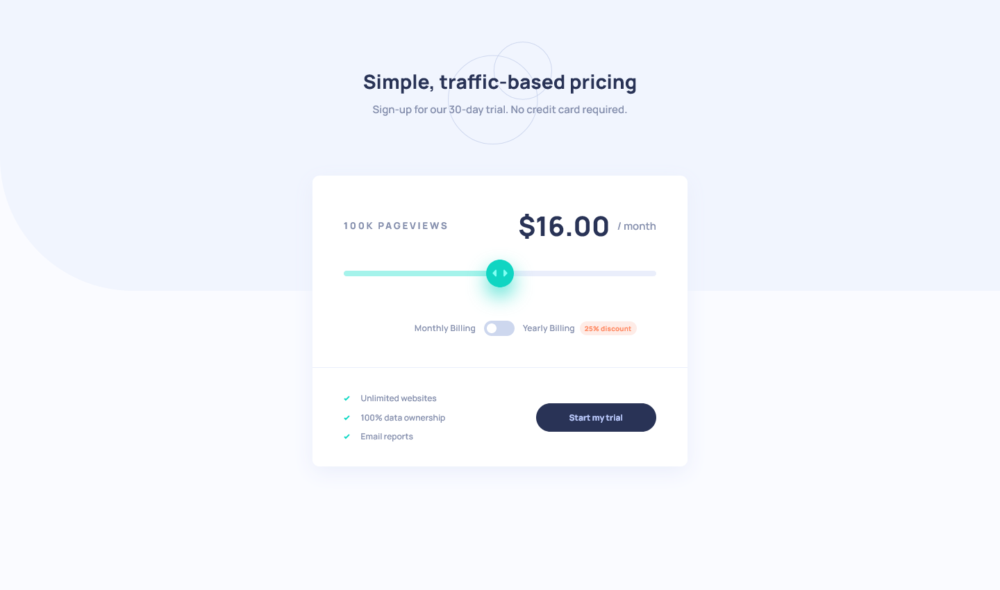

# Frontend Mentor - Interactive pricing component solution

This is a solution to the [Interactive pricing component challenge on Frontend Mentor](https://www.frontendmentor.io/challenges/interactive-pricing-component-t0m8PIyY8). Frontend Mentor challenges help you improve your coding skills by building realistic projects.

This solution works best on Firefox and Chromium browsers.

## Table of contents

- [Overview](#overview)
  - [The challenge](#the-challenge)
  - [Screenshot](#screenshot)
  - [Links](#links)
- [My process](#my-process)
  - [Built with](#built-with)
  - [What I learned](#what-i-learned)
  - [Useful resources](#useful-resources)
- [Author](#author)

## Overview

### The challenge

Users should be able to:

- View the optimal layout for the app depending on their device's screen size
- See hover states for all interactive elements on the page
- Use the slider and toggle to see prices for different page view numbers

### Screenshot

### Links

- Solution URL: #
- Live Site URL: https://alimansoor-create.github.io/frontend-mentor/interactive-pricing-component

## My process

### Built with

- Semantic HTML5 markup
- Flexbox
- Mobile-first workflow
- Sass
- Custom cross-browser input styling

### What I learned

This challenge taught me how to style the sinister range input. It was really a challenge to get everything to look the way I wanted it to, across multiple browsers. Thanks to [CSS-Tricks](https://css-tricks.com/), however, the process was made easier for me.

### Useful resources

- [CSS-Tricks - Styling the range input](https://css-tricks.com/sliding-nightmare-understanding-range-input/) - This helped me in learning how to style the range slider.

## Author

Syed Ali Mansoor

- Frontend Mentor - [@alimansoor-create](https://www.frontendmentor.io/profile/alimansoor-create)
- Instagram - [@design.alimansoor](https://www.instagram.com/design.alimansoor)
