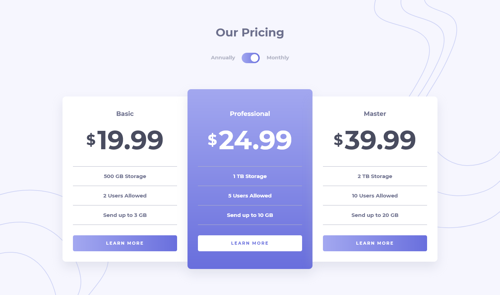

# Frontend Mentor - Pricing component with toggle solution

This is a solution to the [Pricing component with toggle challenge on Frontend Mentor](https://www.frontendmentor.io/challenges/pricing-component-with-toggle-8vPwRMIC). Frontend Mentor challenges help you improve your coding skills by building realistic projects.

## Table of contents

- [Overview](#overview)
  - [The challenge](#the-challenge)
  - [Screenshot](#screenshot)
  - [Links](#links)
- [My process](#my-process)
  - [Built with](#built-with)
  - [What I learned](#what-i-learned)
  - [Continued development](#continued-development)
  - [Useful resources](#useful-resources)
- [Author](#author)

## Overview

### The challenge

Users should be able to:

- View the optimal layout for the component depending on their device's screen size
- Control the toggle with both their mouse/trackpad and their keyboard

### Screenshot



### Links

- Solution URL: #
- Live Site URL: https://alimansoor-create.github.io/frontend-mentor/pricing-component-with-billing-toggle

## My process

### Built with

- Semantic HTML5 markup
  - `<section>` as a wrapper
  - `<main>` for the card area
  - `<article>` for each of the cards
- BEM naming for the cards
- Sass mixins
  - To create a template gradient function, which takes the direction as an input and adds a background purple gradient
- Flexbox
- Mobile-first workflow

### What I learned

- Creating toggle switches from scratch using labels, checkboxes, and the `::before` pseudo-element
- Using a Sass mixin to create a function that adds a background gradient to any element.

```css
@mixin grad-purple($direction) {
  background: linear-gradient(
    to $direction,
    hsl(236, 72%, 79%),
    hsl(237, 63%, 64%)
  );
}
```

### Continued development

I used mixins in this project for the first time, and I aim to learn more about them and the power they offer, and use them in my future projects. <br>
I also wish to learn more about pseudo-elements, and how they can be utilized to make interesting components/layouts/etc.

### Useful resources

- [W3 Schools Toggle Switch Tutorial](https://www.w3schools.com/howto/howto_css_switch.asp) - This site helped me in creating the toggle switch.

## Author

- Instagram - [@design.alimansoor](https://www.instagram.com/design.alimansoor)
- Frontend Mentor - [@alimansoor-create](https://www.frontendmentor.io/profile/alimansoor-create)
